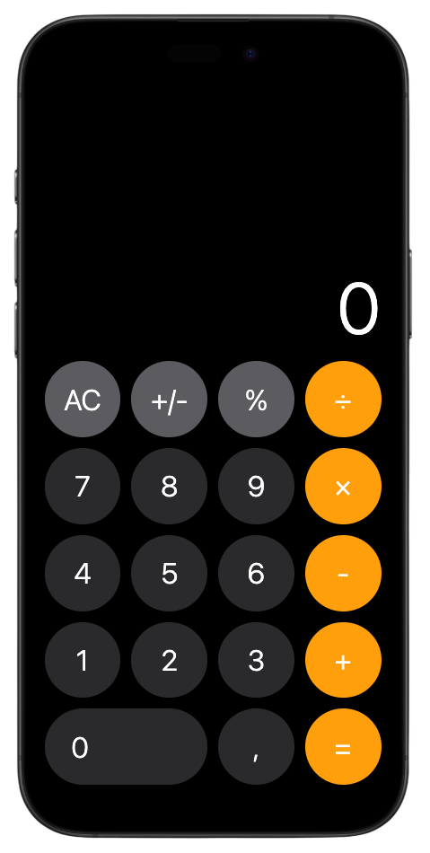

# React iOS calculator


## Main deps


## Project structure

```
react-ios-calculator/
├── public/                             # Static files
├── src/
│   ├── assets/                         # App assets
│   │   └── styles/
│   │       └── global.css
│   ├── components/                     # App components
│   │   ├── Calculator/
│   │   │   ├── Calculator.tsx
│   │   │   ├── CalculatorButton.tsx
│   │   │   ├── CalculatorDisplay.tsx
│   │   │   └── styles.module.css
│   │   └── IPhoneFrame/
│   │       ├── IPhoneFrame.tsx
│   │       └── styles.module.css
│   ├── hooks/                          # App custom hooks
│   │   ├── useCalculator.ts
│   │   ├── useKeyboardInput.ts
│   │   └── useSound.ts
│   ├── App.tsx                         # App UI
│   └── main.tsx                        # App entry file
├── index.html                          # HTML template
└── vite.config.ts                      # Vite configuration
```

## Features

- Accurate iOS calculator design and layout
- Full basic calculator functionality
- Keyboard and mouse support
- iOS-like sound effects
- Responsive design (full screen on mobile, iPhone frame on desktop)
- Components with separated logic and UI
- TypeScript for type safety
- CSS modules for scoped styling
- Full PWA support optimization

## In progress

- Input of numbers of infinite length with left gradient

## Controls

- Digits 0-9
- Operations: '+', '-', '*', '/'
- 'Enter' or '=' for calculation
- 'Escape' for clear
- 'Backspace' for delete
- '%' for percentage
- '_' for sign toggle
- Mouse clicks

## Quick start

1. Install all dependencies using `yarn` or `npm install`
2. Start the development server using `yarn dev` or `npm run dev`
3. Open up [http://localhost:3000](http://localhost:3000)

## License

[MIT](https://github.com/FreeeeZ/react-ios-calculator/blob/main/LICENSE)

Copyright (c) 2025, Shell Vladislav
